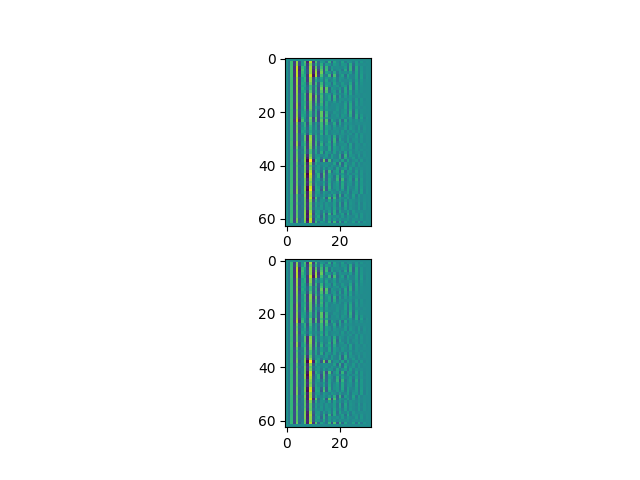
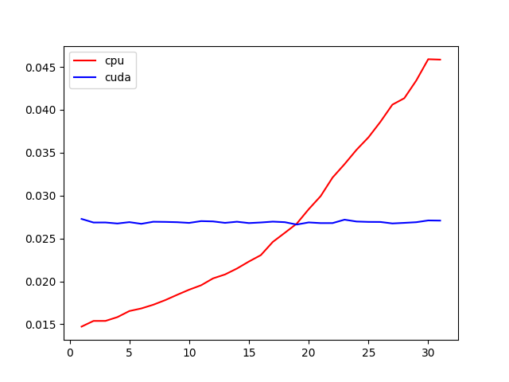

LPC Utility for Pytorch Library.

# LPC Torch

LPCTorch is a small pytorch utility for Linear Predictive Coding. It provides a simple way to compute windowed Linear Predictive Coding Coefficients on a input audio signal. The repo uses the Burg's methods [[1]] and is heavily inspired from the librosa audio library implementation [[2]].

## Install

Install the module using the pip utility ( may require to run as sudo )

```bash
pip3 install lpctorch
```

## Usage

### LPC Coefficients

```python
from lpctorch import LPCCoefficients

# Parameters
#     * sr            : sample rate of the signal ( 16 kHz )
#     * n_frames      : number of frames to slice the signal
#     * frame_duration: duration of the window in seconds ( 16 ms )
#     * frame_overlap : frame overlapping factor
#     * K             : number of linear predictive coding coefficients
sr             = 16000
n_frames       = 64
frame_duration = .016
frame_overlap  = .5
K              = 32

# Initialize the module given all the parameters
lpc_prep       = LPCCoefficients(
    sr,
    n_frames,
    frame_duration,
    frame_overlap,
    order = ( K - 1 )
)

# Get the coefficients given a signal
# torch.Tensor of size ( Batch, Samples )
alphas         = lpc_prep( X )
```

## Example

The repository provides an example application with a 'sample.wav' file.
The output is the same as the one provided by librosa (bottom).



## Benchmarks

Here are some benchmarks comparing cpu vs gpu inference times in seconds of the utility from 1 to 32 batch size.



## References

* [[1]] Larry Marple A New Autoregressive Spectrum Analysis Algorithm IEEE Transactions on Accoustics, Speech, and Signal Processing vol 28, no. 4, 1980
* [[2]] Librosa LPC Burg's Method Implementation

[1]: https://ieeexplore.ieee.org/document/1163429
[2]: https://librosa.github.io/librosa/_modules/librosa/core/audio.html#lpc
